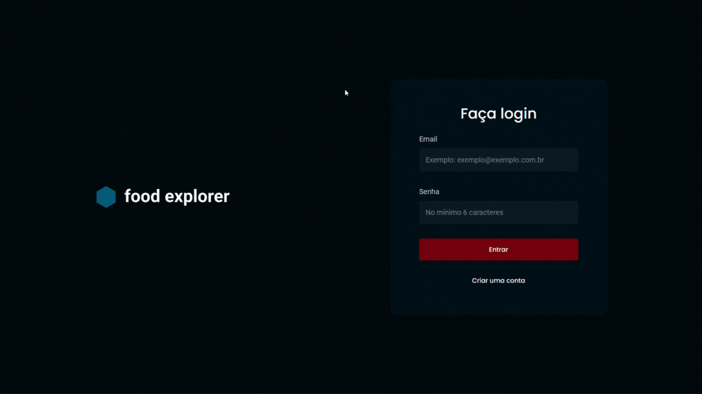

# Food Explorer

Esse projeto é uma API Restful de uma aplicação completa - tanto back-end, quanto front-end - de cardápio digital para um restaurante fictício, conhecido como Food Explorer.

O Food Explorer terá duas personas: o admin e o usuário.

O admin é a pessoa responsável pelo restaurante, logo, poderá criar, visualizar, editar e apagar um prato a qualquer momento. Cada prato deve conter uma imagem, um nome, uma categoria, uma breve descrição, os ingredientes e o seu preço. Ao clicar em adicionar prato, o admin receberá uma mensagem de sucesso e será redirecionado para a página principal.

O usuário irá visualizar todos os pratos cadastrados e, quando clicar em um prato, será redirecionado para uma nova tela com informações mais detalhadas sobre ele.


## Demonstração




## Funcionalidades

- cadastro e autenticação de usuários;
- buscar prato por nome ou ingredientes;
- cadastro de um novo prato;
- atualização de um prato;
- exclusão de pratos;
- exibição de detalhes de um prato;


## Tecnologias utilizadas

- ReactJS;
- React Router DOM;
- Styled Components;
- Vite;
- Swipper;


## Acesso

Link de acesso ao projeto: https://foodexplo.netlify.app/


## Execução do projeto

```bash
# clone o projeto e acesse a pasta
$ git clone https://github.com/josevictorn/food-explorer-frontend.git
$ cd web

# instale as dependências
$ npm i

# execute o projeto
$ npm run dev
```

## Autor

Feito com amor por [@josevictorn](https://github.com/josevictorn)
